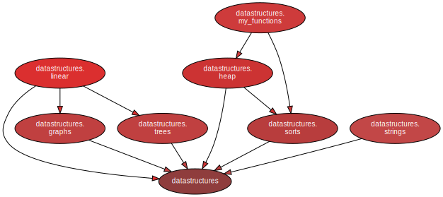

Python DataStructures by slav_EEik
===================================

## About the project

This is a simple datastructures and algorithms library. It is also published on [PyPi](https://pypi.org/project/slav-eeik-datastructures/).

You can see the automatically-generated **documentation on [GitHub Pages](https://zhukovrost.github.io/datastructures/)**.

**Here are all implemented datastructures:**

- Lists
  - Singly Linked List
  - Doubly Linked List
  - Static Array

- Linear Structures
  - Stack
  - Queue
  - Deque

- Heaps
  - Min Heap
  - Priority Queue

- Trees and Tree Nodes
  - Binary Tree
  - Huffman Tree
  - Balancing Tree
  - Binary Search Tree
  - Red Black Tree
  - 2-3 Tree
  - Segment Tree 
  - AVL Tree
  - Trie

- Graphs
  - Adjacency List
  - Adjacency Matrix

**Note:** *trees.nodes.BinaryNode* and *trees.nodes.BalancedNode* don't have their trees, so you can use them.
It is not recommended to use all other nodes without their trees.

**Here are all implemented algorithms:**

- Sorting Algorithms:
    - Heap Sort
    - Bubble Sort
    - Quick Sort
    - Merge Sort
    - Insertion Sort
    - Selection sort
 
- String search algorithms:
  - Brute Force Search
  - Rabin-Karp Algorithm
  
- Tree Algorithms:
  - Tree balancing
  - Huffman Coding

- Graphs Algorithms:
  - Dijkstra algorithm
  - Bellman-Ford's algorithm
  - A* Algorithm
  - Breadth First Search
  - Depth First Search

## Modules



## Installation

```sh
pip install --upgrade pip
pip install slav-eeik-datastructures
```

## Examples

Here are some examples of using the library:

```python
from datastructures.linear import Stack, SinglyLinkedList


s = Stack()
s.push("First item")
s.push("Second item")
print(s.pop()) # Second item
print(s.peek()) # First item
print(s.peek()) # First item

l = SinglyLinkedList()
l.build([1, 2, 3, 4, 5, 6, 7, 8])
print(l[4]) # 5
l.delete_at(4)
print(l) # 1 -> 2 -> 3 -> 4 -> 6 -> 7 -> 8
```

```python
from datastructures.sorts import merge_sort, quicksort, heap_sort


arr = [5, 4, 6, 1, 7, 10, -5, 9]
print(merge_sort(arr))              # [-5, 1, 4, 5, 6, 7, 9, 10]
print(quicksort(arr, reverse=True)) # [10, 9, 7, 6, 5, 4, 1, -5]
print(arr)                          # [5, 4, 6, 1, 7, 10, -5, 9]
heap_sort(arr, inplace=True)
print(arr)                          # [-5, 1, 4, 5, 6, 7, 9, 10]
```

```python
from datastructures.graphs import ListAdjacency as Graph


g = Graph(6, False)
g.add_edge(0, 1, 1)
g.add_edge(0, 2, 5)
g.add_edge(1, 3, 2)
g.add_edge(2, 3, 3)

distance, path = g.dijkstra(0, 3)
print(distance)                             # 3
print(path)                                 # [0, 1, 3]
print(list(g.breadth_first_traversal(0)))   # [0, 2, 1, 3]
```

```python
from datastructures.trees.trees import AVLTree


t = AVLTree()
t.build([9, 3, 5, 2, 9, 8, 2, 3, 4, 1])
print(t)    # BinaryTree(['Node(1)', 'Node(2)', 'Node(3)', 'Node(4)', 'Node(5)', 'Node(8)', 'Node(9)'])
t.insert(6)
print(t)    # BinaryTree(['Node(1)', 'Node(2)', 'Node(3)', 'Node(4)', 'Node(5)', 'Node(6)', 'Node(8)', 'Node(9)'])
print(t.find_min()) # 1
print(list(t.root.preorder_traversal())) # [Node(5), Node(3), Node(2), Node(1), Node(4), Node(8), Node(6), Node(9)]
```

## License
This project is licensed under the MIT License - see the [LICENSE file](https://github.com/zhukovrost/datastructures/blob/master/LICENSE) for details.

## Contacts
For any inquiries, please reach out to the project maintainer on [GitHub](https://github.com/zhukovrost) or [Telegram](https://t.me/slav_EEik).
